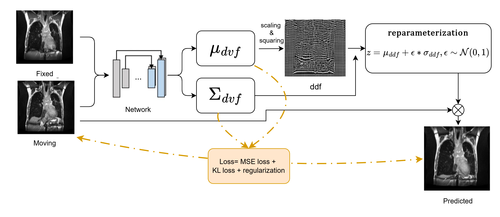

# TM-prob: TransMorph-prob

A variational Bayesian deep-learning model for **uncertainty-aware deformable image registration**, developed for dose accumulation in MRI-guided radiotherapy (MRgRT) of lung cancer.

TM-prob predicts a voxel-wise **Gaussian distribution over dense displacement fields (DDFs)** — mean and variance — in a single forward pass, rather than a single deterministic deformation. Spatially correlated uncertainty samples are drawn via frequency-domain filtering with an anisotropic Gaussian-process prior, so the resulting displacement uncertainty is smooth and physically plausible rather than voxel-independent noise.



*The fixed and moving images are concatenated and passed through a TransMorph (transformer-convolution) backbone to predict a voxel-wise mean deformation velocity field (DVF) and diagonal covariance of the DDF. The mean DVF is integrated via scaling-and-squaring into a diffeomorphic mean DDF; a DDF sample is then drawn via the reparameterization trick with frequency-domain correlated noise.*

## Why

A single deterministic displacement field gives no indication of where a registration is unreliable. In online adaptive MRgRT, that matters: registration can degrade locally due to low tissue contrast, residual motion, or anatomy outside the training distribution, and unquantified displacement error propagates directly into contour and accumulated-dose uncertainty. TM-prob produces calibrated, spatially resolved uncertainty in a single forward pass plus lightweight sampling — avoiding the repeated stochastic inference required by Monte Carlo dropout or ensembles — so it stays compatible with the tight time budget of online adaptive treatment sessions.

## Model

- **Backbone**: TransMorph, a hybrid transformer/convolutional architecture for 3D deformable image registration ([Chen et al., 2022](https://github.com/junyuchen245/TransMorph_Transformer_for_Medical_Image_Registration)).
- **Output**: voxel-wise mean DVF and log-variance; the mean is integrated via scaling-and-squaring into a diffeomorphic DDF.
- **Uncertainty sampling**: reparameterization with noise filtered in the frequency domain (anisotropic Gaussian kernel, physical correlation length in mm) to produce spatially correlated DDF samples.
- **Loss**: image MSE + bending-energy regularization + Dice (auxiliary label supervision) + a frequency-domain Gaussian-process KL term regularizing the predicted variance toward a prior, with a warm-up schedule so the model first learns accurate alignment before the variance term is enabled.
- **Downstream uncertainty propagation**: DDF samples can be warped through to organ contours (including dilated GTV margins) and dose distributions, giving mean/std maps for clinical review.

See [`model.py`](model.py) for the full implementation (`TMProb` LightningModule) and [`models/`](models) for the TransMorph backbone.

## Repository layout

```
model.py               TMProb LightningModule + uncertainty sampling / TRE / contour-and-dose propagation utilities
models/
  TransMorph_bayesian_2.py   TransMorph backbone predicting (DVF mean, log-variance)
  configs_TransMorph.py      Architecture configs (embed dim, depths, window size, ...)
dataset.py              Manifest-driven paired-registration dataset (MONAI transforms)
train.py                Training entry point
val.py                  Validation / checkpoint evaluation entry point
requirements.txt
figures/architecture.png
```

## Installation

```bash
pip install -r requirements.txt
```

Requires a CUDA GPU for training/inference at typical volume sizes (e.g. 320×224×160).

## Data format

Training and validation pairs are described by a JSON manifest — a list of dicts, each one fixed/moving image pair:

```json
[
  {
    "fixed_image": "path/to/case001/fixed_image.mha",
    "moving_image": "path/to/case001/moving_image.mha",
    "fixed_label": "path/to/case001/fixed_label.mha",
    "moving_label": "path/to/case001/moving_label.mha",
    "fixed_dose": "path/to/case001/fixed_dose.mha",
    "moving_dose": "path/to/case001/moving_dose.mha",
    "fixed_PTV": "path/to/case001/fixed_PTV.mha",
    "moving_PTV": "path/to/case001/moving_PTV.mha"
  }
]
```

`fixed_dose`/`moving_dose`/`fixed_PTV`/`moving_PTV` are optional and only needed for dose-uncertainty propagation at validation time. Labels are single integer-encoded segmentation volumes; class order (1–8) is Lung Left, Lung Right, Spinal Canal, Trachea, Aorta, Esophagus, Heart, GTV, matching `sample_contours` in `model.py`.

For landmark-based TRE evaluation, place a CSV of moving/fixed landmark voxel coordinates alongside each case (see `TMProb.validation_step` in `model.py` for the expected naming convention, or adapt the path there to your own layout).

## Training

```bash
python train.py --train-manifest data/train.json --val-manifest data/val.json \
    --logdir ./logs --epochs 200
```

Key hyperparameters (see `train.py --help` for the full list): `--lr`, `--lMSE`, `--lBE`, `--kl`, `--prior-lambda` (prior variance), `--correlation-length` (mm), `--kl-warmup-epochs`.

## Validation

```bash
python val.py --val-manifest data/val.json --ckpt path/to/checkpoint.ckpt \
    --save-samples-for 0 5 10
```

`--save-samples-for` selects which validation batch indices get full DDF-sample propagation to contours/doses written to disk (this is expensive to do for every case).

## Citation

This code accompanies the manuscript:

> Chengtao Wei, Domagoj Radonic, Rabea Klaar, Natascha Hohmann, Sebastian N. Marschner, Chukwuka Eze, Stefanie Corradini, Claus Belka, Guillaume Landry, Moritz Rabe, Christopher Kurz.
> **An Uncertainty-aware Deep Learning-based Registration Model for Adaptive Lung Cancer Radiotherapy.**
> Department of Radiation Oncology, LMU University Hospital, LMU Munich. *Manuscript under review.*

Please update this citation with the final venue/DOI once published, and add a `LICENSE` file before making the repository public.
